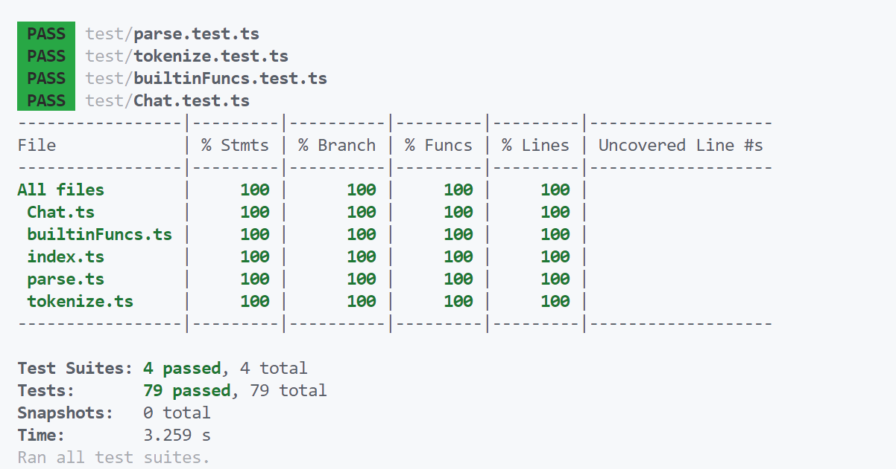

# 介绍

## 任务要求

领域特定语言（Domain Specific Language，DSL）可以提供一种相对简单的文法，用于特定领域的业务流程定制。本作业要求定义一个领域特定脚本语言，这个语言能够描述在线客服机器人（机器人客服是目前提升客服效率的重要技术，在银行、通信和商务等领域的复杂信息系统中有广泛的应用）的自动应答逻辑，并设计实现一个解释器解释执行这个脚本，可以根据用户的不同输入，根据脚本的逻辑设计给出相应的应答。

## 作品概述

ChattyCat是本作品实现的客服机器人系统。ChattyCat的脚本语言CCSL（ChattyCat Script Language）用于编写机器人的自动应答逻辑。该语言在便于编写常见应答逻辑的同时也提供一定的逻辑控制能力，还可以通过调用外部函数来实现更复杂的功能。

ChattyCat使用TypeScript编写，能够方便地在网页上实现一个客服机器人系统，也可以通过node在后端上运行。

为了体现封装和复用的思想，ChattyCat的核心部分被单独封装为一个npm包(`chatty-cat`)，对外提供一套API接口，与外部的交互系统解耦。这样，ChattyCat既可以在前端直接运行，也可以经由网络在后端运行；既可以以聊天框的形式交互，也可以以语音对话的形式交互。

为了作品的完整性，还提供了一个基于Vue的前端页面(`chatty-cat-demo`)，用于展示ChattyCat的功能。在这个网页中，用户可以动态地编写和调试CCSL脚本，并通过聊天框与ChattyCat进行对话。

# 脚本文档

## 示例

在叙述CCSL脚本的语法前，为了便于理解，先给出一段示例脚本。这段脚本模拟了一个快递公司的客服机器人。

```
state main
    enter
        say "您好，请问您有什么需要的吗？"
        goto menu
        
state menu
    enter
        suggest "我的快递怎么还没有到", "查询运单", "什么是疑难件"
    case "你好"
        say random("你好！", "你好，祝你生活愉快！")
    case /没到|没有到/
        say "很抱歉您的快递还没有到达，你可以说“查询运单”来让我帮你查询"
        suggest "查询运单"
    case /为什么/
        say "对不起，我还不能解答你的问题"
    case /查询/
        goto query
    case "什么是疑难件"
        say "疑难件是指快递在运输过程中出现问题的快件，例如：地址不详、无人签收、货物破损等。"
    default
        say random("对不起，我不能理解", "抱歉，我还不能完成这项功能")
        goto menu
    silent 5
        suggest "我的快递怎么还没有到", "查询运单", "什么是疑难件"
    silent 10
        say "您好，请问您还在吗？"

state query
    enter
        say "您是要查询运单吗？请输入您的运单号"
    case /^\d{10}$/
        let $valid = validateNumber()        
        [$valid] say "这边帮您查询到您运单的信息是" + queryNumber()
        [not($valid)] say "抱歉，没有查询到您的运单信息"
        goto menu
    case /退出|离开|结束|不/
        goto menu
    default
        say "运单号格式不正确，请问您要退出查询吗？"
        suggest "退出"
```

此外，`#`符号直到行尾的内容都会被视为注释，不会被解析。

注意CCSL并不强制要求缩进，任何缩进和换行方式都是可以接受的。但为了可读性，建议使用示例代码的缩进方式。

这段示例脚本足以粗略地展示CCSL的语法。下面将详细介绍CCSL的语法。

## 脚本结构

### 状态

状态（State）是CCSL脚本的基本组成单位。每一个CCSL脚本都由若干个状态组成，且在任意时刻只会处于一个状态。每一个状态都有一个名称，名称由字母、数字和下划线组成，名称不能以数字开头。定义状态的语法如下：

`state 类型名 {事件}`

### 事件

事件（Event）是状态的组成部分，每一个状态都可以包含若干个事件。在一定条件下事件会被触发，并执行对应的语句序列。

CCSL脚本中的事件包括如下几种：

#### enter

格式： `enter {语句序列}`

enter事件在进入状态时触发。一个状态至多只能有一个enter事件。

#### case

格式： `case 字符串/正则表达式 {语句序列}`

case事件在用户输入匹配给定字符串或正则表达式时触发。如果状态存在多个case事件，那么它们会按照定义的顺序依次匹配并执行第一个匹配到的case事件。若匹配到使用正则表达式的case事件，则会将变量 `$0`，`$1`，`$2`，...，`$n` 设置为正则表达式的捕获组。

#### default

格式： `default {语句序列}`

default事件在用户输入不匹配任何case事件时触发。一个状态至多只能有一个enter事件。

#### silent

格式： `silent 数字 {语句序列}`

silent事件在用户没有输入内容的指定秒数触发。如果状态存在多个秒数相同的silent，那么它们会按照定义的顺序依次执行。

### 语句

语句（Statement）是CCSL脚本的基本执行单位。CCSL脚本包括如下语句：

#### say

格式： `say 表达式`

say语句向用户发送表达式计算得出的消息。

#### suggest

格式： `suggest 表达式 {, 表达式}`

suggest语句向用户给出一系列建议输入的内容。

#### delay

格式： `delay 数字`

delay语句暂停执行指定秒数。脚本执行到delay语句时会进入挂起状态直到delay延时结束。在挂起状态下，所有事件（用户输入和silent）都会被屏蔽。

#### goto

格式： `goto 状态名`

goto语句跳转到指定状态，goto语句后的语句不会被执行。

#### exit

格式： `exit`

exit语句结束对话，机器人将不再接受用户输入，goto语句后的语句不会被执行。

#### let

格式： `let 变量名 = 表达式`

let语句将表达式计算得出的值赋给变量。

#### 条件执行

每一条语句前都可加上一个用方括号括起来的表达式，当表达式计算结果为真（即不等于`"0"`）时才会执行该语句。

## 表达式、变量与外部函数

在say、suggest、let语句和表示条件执行的方括号中可以使用表达式。表达式由字符串字面量、变量、字符串拼接、外部函数调用组成。

CCSL中的变量只有字符串类型。变量名必须以`$`符号开头，后跟字母、数字或下划线。变量可以使用let语句创建，也可以在宿主程序创建`Chat`实例时给定初始变量集合。使用未定义的变量会产生运行时错误。所有变量的作用域都是全局的，可以在任意状态中共享。

CCSL只有一种运算符：`+`，用于字符串拼接，例如`"hello" + "world"`的值为`"helloworld"`。

更加高级的功能通过外部函数提供。外部函数是一个javascript函数，它的参数即为希望在CCSL脚本中传入的参数。外部函数的返回值类型必须是`string`（同步函数）或`Promise<string>`（异步函数），否则会产生运行时错误。在外部函数中使用 throw 语句可以抛出一个运行时错误。

CCSL提供了一些内置的外部函数，例如`random`函数可以从给定的字符串中随机选择一个字符串返回。宿主程序创建`Chat`实例的时候也可以给定外部函数集合，这样CCSL脚本就可以调用这些外部函数。

由于变量只有字符串类型，CCSL对逻辑和数学运算的支持方式较为特别。

逻辑上，CCSL将字符串`"0"`视为假，将非`"0"`的字符串视为真。请特别注意，空串`""`也视为真。因此，调用内置函数`not("")`的结果为`"0"`。

数学运算上，CCSL的内置函数在需要运算时将字符串视为数字，运算完成后再转回字符串返回。例如，调用内置函数`add("1", "2")`的结果为`"3"`。

## 内置外部函数

CCSL提供了如下的内置外部函数。如果输入参数个数错误，这些函数会产生运行时错误。部分函数将输入字符串当作数字处理，如果输入字符串不是数字则会产生运行时错误。

#### `iff(cond, t, f)`
如果cond不为`"0"`，则返回t，否则返回f。

#### `and(...args)`
如果所有参数都不为`"0"`，则返回`"1"`，否则返回`"0"`。

#### `or(...args)`
如果有任意一个参数不为`"0"`，则返回`"1"`，否则返回`"0"`。

#### `not(a)`
如果a为`"0"`，则返回`"1"`，否则返回`"0"`。

#### `eq(a, b)`
如果a等于b，则返回`"1"`，否则返回`"0"`。

#### `neq(a, b)`
如果a不等于b，则返回`"1"`，否则返回`"0"`。

#### `len(a)`
返回a的长度。

#### `strcmp(a, b)`
按字典序进行比较，如果a等于b，则返回`"0"`，如果a大于b，则返回`"1"`，如果a小于b，则返回`"-1"`。

#### `numcmp(a, b)`
将a和b视为数字进行比较，如果a等于b，则返回`"0"`，如果a大于b，则返回`"1"`，如果a小于b，则返回`"-1"`。

#### `add(a, b)`
将a和b视为数字，返回$a+b$的字符串形式。

#### `sub(a, b)`
将a和b视为数字，返回$a-b$的字符串形式。

#### `mul(a, b)`
将a和b视为数字，返回$a \times b$的字符串形式。

#### `div(a, b)`
将a和b视为数字，返回$a/b$的字符串形式。

#### `mod(a, b)`
将a和b视为数字，返回$a \bmod b$的字符串形式。

#### `random(...args)`
从args中随机选择一个字符串返回，至少需要一个参数。

#### `randomInt(min, max)`
将min和max视为数字，从$[\text{min}, \text{max}]$中随机选择一个整数以字符串形式返回，min和max必须是整数，且$\text{min} \le \text{max}$。

#### `time()`
返回当前时间的本地字符串形式。

#### `date()`
返回当前日期的本地字符串形式。

## 异步操作

为了避免在前端使用ChattyCat时阻塞UI，调用异步外部函数（即返回`Promise<string>`的外部函数）和delay语句是异步完成的。但为了避免交叠地执行多个事件中的代码，在调用异步的外部函数或使用delay语句时，CCSL脚本会进入挂起状态，直到异步操作完成。在挂起状态下，所有事件（用户输入和silent）都会被屏蔽。

# 系统设计

## 核心库实现

### 整体架构

核心库的整体架构见下图。


CCSL源代码首先通过词法分析器转换为Token流，然后通过语法分析器转换为Script对象。之后使用Script对象、用户提供的ChatOptions配置选项以及内置外部函数builtinFuncs一起组成一个对话实例`Chat`。可以使用同一个`Script`对象创建多个`Chat`实例，但是每个`Chat`实例的上下文是独立的。

### 数据结构

ChattyCat 合理地设计了程序中用到的各种数据结构，并为其编写了TypeScript类型标注。下面介绍一些重要的数据结构。

#### TokenType & Token

用于表示词法分析的结果，详见“词法分析”一节。

```ts
export enum TokenType {
  word,
  string,
  regexp,
  number,
  punctuator,
  end
}

export type Token = {
  type: TokenType;
  value: string;
  line: number;
  col: number;
};
```

#### Expression

用和类型表示各种表达式。

```ts
export type Expression =
  | {
      type: 'str';
      value: string;
    }
  | {
      type: 'var';
      value: string;
    }
  | {
      type: 'concat';
      lhs: Expression;
      rhs: Expression;
    }
  | {
      type: 'func';
      name: string;
      args: Expression[];
    };
```

#### Statement

同样使用和类型表示各种语句。

```ts
type StatementSay = { type: 'say'; text: Expression };
type StatementSuggest = { type: 'suggest'; suggestions: Expression[] };
type StatementDelay = { type: 'delay'; timeout: number };
type StatementGoto = { type: 'goto'; stateName: string };
type StatementExit = { type: 'exit' };
type StatementLet = { type: 'let'; lhs: string; rhs: Expression };
export type Statement = (
  | StatementSay
  | StatementSuggest
  | StatementDelay
  | StatementGoto
  | StatementExit
  | StatementLet
) & { cond?: Expression };
export type Statements = Statement[];
```

#### State

State 表示一个状态，包含了状态的名称和其中的各种事件。

```ts
export interface State {
  name: string;
  enterEvent?: Statements;
  caseEvents: { cond: string | RegExp; event: Statements }[];
  defaultEvent?: Statements;
  silentEvents: { delay: number; event: Statements }[];
}
```

#### Script

Script 的实质就是State的集合。

```ts
export interface Script {
  states: Record<string, State>;
}
```

#### 对象集合 & 外部函数集合

由于JavaScript/TypeScript中对象实际上就是字典，使用对象存储已经足够高效。

```ts
variables: Record<string, string>;
funcs: Record<string, ((...args: string[]) => string | Promise<string>) | undefined>;
```

### 词法分析

CCSL包含的词法元素不多，可以较为简单地完成词法分析。词法分析器的代码见`src/tokenize.ts`。

为了实现上的方便，将关键字和标识符（包括状态名、变量名和函数名）统一认为是一种类型的Token，称为`word`，故共有如下几种类型的Token：

- `word`：关键字和标识符
- `string`：字符串
- `regex`：正则表达式
- `number`：数字
- `punctuator`：标点符号（包括`()[]=,+`）
- `end`：结束标志

在这里简单地认为正则表达式由`/`开头，以后续第一个不是`\/`的后缀的`/`结束。这样的正则表达式和javascript中的正则表达式的识别规则稍有不同，要求在编写时对所有`/`符号进行转义。

在词法分析的过程中，除了记录Token的类型和值，还需要其所在的的行号和列号，以便在语法分析出现错误时给出错误位置。

词法分析时，如果遇到无法识别的字符、未闭合的字符串或未闭合的正则表达式，都会产生词法错误。

### 语法分析

语法分析使用手写递归下降方法实现，代码见`src/parse.ts`。

CCSL的语法是严格的LL(1)文法，因此语法分析的过程简单而一致，只需要每次根据下一个Token的类型进行相应操作即可。

语法分析器还会检查脚本中是否未定义main状态、是否重复定义状态。以及goto语句中的状态名是否存在。如果发现这些错误，语法分析器也会给出语法错误。

### 解释器

解释器的代码见`src/Chat.ts`。

解释器是ChattyCat的核心功能，也是调用者与ChattyCat交互的主要接口，能够根据输入或silent时间触发相应事件，并根据语法树（即`Script`对象）执行相应的语句序列。

考虑到外部函数往往需要进行异步操作（如发起网络请求），解释器的执行过程也是异步的。在调用`start`和`input`函数返回时，对应的语句序列不一定执行完毕。可以对函数返回的Promise对象进行await操作，等待语句序列执行完毕。在等待异步操作时，解释器会进入挂起状态，此时所有事件（用户输入和silent）都会被屏蔽，唯一的例外是仍然可以使用`stop`函数结束对话，这种情况下未完成的异步操作仍将会继续执行，但不再会向外部输出任何动作。

关于解释器的API细节，请阅读下一节的核心库接口文档。

## 核心库接口文档

下面给出ChattyCat核心库的接口文档。可以在`chatty-cat/docs`目录下查看使用TypeDoc构建的html版本的文档。

### 函数

#### parse

`parse(source): Script`

解析给定的源代码字符串，返回一个脚本对象。

**参数** `source: string` 源代码字符串

**返回**  `Script` 解析后的脚本对象

### 接口

#### ChatOptions

创建对话实例时指定的选项

##### 属性

- `script: Script` 用于创建实例的脚本
- `variables?: Record<string, string>` 可选的初始变量集合
- `funcs?: Record<string, (...args: string[]) => string | Promise<string>>` 可选的自定义外部函数集合
- `output: (text: string) => void` 输出回调函数
- `suggest?: (texts: string[]) => void` 可选的建议回调函数
- `error?: (error: string) => void` 可选的错误处理回调函数，在发生运行时错误时调用
- `update?: () => void` 可选的更新回调函数，在对话实例的内部状态发生变换时调用

#### Script

脚本对象

##### 属性

- `states`

### 类

#### Chat

对话实例

创建对话实例后需要首先调用 start 方法启动对话，然后可以调用 input 方法输入文本。

一个对话实例包含如下上下文信息：

- 当前状态
- 变量集合
- 外部函数集合
- 是否退出
- 是否处于挂起状态

当以上信息发生变化时，会调用 update 回调函数，以便更新 UI。也可以在使用过程中直接修改变量集合和外部函数集合。

##### 构造函数

`new Chat(options): Chat`

创建对话实例。

**参数** `options: ChatOptions` 对话实例的选项

##### 属性

- `currentState: State` 当前状态
- `variables: Record<string, string>` 变量集合
- `funcs: Record<string, ((...args: string[]) => string | Promise<string>) | undefined>` 外部函数集合
- `exited: boolean` 是否退出
- `suspending: boolean` 是否处于挂起状态

##### 方法

- `start(): Promise<void>`
  启动对话启动对话实例，通常这会触发main状态的enter事件，并开始main状态的silent事件计时。 
  如果脚本已经启动，则不会有任何效果。

  **返回** `Promise<void>` 一个 Promise，当所有相关语句全部执行完毕时 resolve

- `input(text: string): Promise<void>`
  输入文本。 如果脚本已经退出或者处于挂起状态，则不会有任何效果。

  **参数** `text: string` 输入的文本

  **返回** `Promise<void>` 一个 Promise，当所有相关语句全部执行完毕时 resolve

- `stop(): void` 停止对话实例。 如果脚本已经退出，则不会有任何效果。 调用后会触发一次 update 回调函数通知 exited 变量发生变化，此后不会再触发任何回调函数。

## 前端页面

### 使用说明

用于演示的前端页面是一个基于[Vue](https://cn.vuejs.org/)的单页应用，使用[Vite](https://cn.vitejs.dev/)工具链和[ElementPlus](https://element-plus.org/zh-CN/)组件库。在页面中能够便捷地探索ChattyCat以及编写CCSL代码。前端页面的源代码位于`chatty-cat-demo`目录中。

整个界面分为三个板块：左上侧的编辑器、左下侧的控制台和右侧的聊天框。


在编辑器中可以编写CCSL脚本以及javascript外部函数。编辑器使用[Monaco Editor](https://microsoft.github.io/monaco-editor/)组件，具有优秀的编辑体验。还使用[Monarch](https://microsoft.github.io/monaco-editor/monarch.html)编写了CCSL的词法高亮，可以在编辑器中高亮显示CCSL脚本。

在控制台中可以应用脚本、加载实例脚本、查看当前脚本处在的状态、查看语法错误和运行时错误，还可以在运行时对脚本中的变量进行编辑。

在聊天框中可以以用户的身份进行对话，对脚本进行实际测试。

### 代码结构

前端页面由两个Vue组件组成：顶层组件`App.vue`和聊天框组件`ChatBox.vue`。用户在聊天框输入消息后，聊天框组件会向顶层组件传递事件，顶层组件会调用ChattyCat的API接口，然后将输出传递给聊天框组件，聊天框组件再将输出显示在聊天框中。顶层组件的控制台则直接调用ChattyCat的API接口。

# 开发方法

## 版本管理

使用了Git进行版本管理。即使是单人开发，使用版本控制系统也更加利于管理修改历史、回滚和多分支开发。


## 代码规范与风格

使用了ESLint和Prettier进行代码规范和风格的检查和格式化。这样可以保证代码的风格统一，也可以避免一些低级错误。

本项目的代码风格为：

- 缩进为2个空格
- 语句结尾使用分号
- 大括号不换行
- 使用单引号
- 单行长度不超过100个字符
- 最后一个
- 列表项后不加逗号
- 类型使用大驼峰命名，其他标识符使用小驼峰命名

代码使用自解释的命名，仅在必要的时候使用注释进行说明。在核心库的公开接口上使用了TypeDoc文档注释。可以使用`npx typedoc src/index.ts`自动地生成html文档。

下面是一段示例代码。

```ts
  /**
   * 输入文本。
   * 如果脚本已经退出或者处于挂起状态，则不会有任何效果。
   * @param text 输入的文本
   * @returns 一个 Promise，当所有相关语句全部执行完毕时 resolve
   */
  async input(text: string) {
    if (this.exited || this.suspending) return;
    this.updateTimeout();
    let matched = false;
    // 选择第一个匹配输入的case的事件
    for (let event of this.currentState.caseEvents) {
      if (typeof event.cond === 'string') {
        if (text === event.cond) {
          await this.exec(event.event);
          matched = true;
          break;
        }
      } else {
        const result = text.match(event.cond);
        if (result !== null) {
          // 将正则表达式的捕获组存入变量
          for (let i = 0; i < result.length; i++) {
            this.variables.set(`$${i}`, result[i]);
          }
          this.update();
          await this.exec(event.event);
          matched = true;
          break;
        }
      }
    }
    // 如果没有匹配的case，则执行default事件
    if (!matched && this.currentState.defaultEvent) {
      await this.exec(this.currentState.defaultEvent);
    }
  }
```

## 测试

ChattyCat实现了完善的自动化测试脚本，并使用了测试桩的思想。

### 核心库

ChattyCat的核心库使用了[Jest](https://jestjs.io/)测试框架进行测试。在`chatty-cat`目录下运行`npm run test`即可运行测试。

测试用例位于`chatty-cat/test`目录下，包含了四组测试用例：

- `tokenize.test.ts` 测试词法分析器
- `parse.test.ts` 测试语法分析器
- `builtinFuncs.test.ts` 测试内置外部函数
- `Chat.test.ts` 测试解释器

测试总代码量达到了1200多行，是核心库代码量的近两倍。测试用例实现了100%的代码覆盖率，包括了各种边界情况。测试用例的编写也帮助我发现了一些之前没有发现的bug，例如词法分析时遇到注释会导致行号计算错误、解释器在处理delay语句和silent事件时的各种边界情况等。

在测试如异步网络请求这样的情况时使用了测试桩，将网络请求替换成一个可以自行控制的异步函数。下面展示一段测试代码。

```ts
test('custom async function', async () => {
  const script = parse(
    `state main
    enter
        say "my name is " + getAttr("name")
`
  );
  let resolver: (value: string) => void;
  const { chat, expectOutput, expectNoMore } = testChat(
    script,
    {},
    {
      async getAttr(attr) {
        if (attr === 'name')
          return new Promise<string>((resolve) => {
            resolver = resolve;
          });
        else throw new Error('unknown attr ' + attr);
      }
    }
  );
  chat.start();
  await jest.advanceTimersByTimeAsync(0);
  resolver!('Alice');
  await jest.advanceTimersByTimeAsync(0);
  expectOutput('my name is Alice');
  expectNoMore();
});
```



### 前端页面

前端页面使用了[Vitest](https://cn.vitest.dev/)测试框架测试。在`chatty-cat-demo`目录下运行`npm run test`即可运行测试。

测试用例位于`chatty-cat-demo/src/test`目录下，包含了两组测试用例：

- `ChatBox.test.ts` 测试聊天框组件
- `App.test.ts` 测试顶层组件

由于前端页面仅仅是用于演示，且逻辑并不复杂，因此测试的要求没有核心库高，没有追求100%的自动化测试代码覆盖率，而是更多地进行人工测试。

在测试顶层组件时，由于Monaco Editor组件不方便在测试环境中运行，因此将Monaco Editor组件替换成了一个测试桩，代码如下：

```ts
vi.mock('@guolao/vue-monaco-editor', () => {
  return {
    useMonaco() {
      return { monacoRef: {} };
    }
  };
});

config.global.stubs = {
  'vue-monaco-editor': {
    template: `<textarea :value="value"
      @input="$emit('update:value', $event.target.value)">
      </textarea>`,
    props: ['value'],
    emits: ['update:value']
  }
};
```


说明：测试报告的错误是由于Vitest测试时是在node环境下模拟DOM运行而非使用真实浏览器环境，导致`scrollTo`这个DOM原生方法不能正常调用，并不是代码本身的错误。

# 总结

在实现ChattyCat的过程中，我应用了这门课中学到的方法，着重学习了接口、测试、文档、记法方面的知识，锻炼了规范编写代码、合理设计程序、解决工程问题等方面的综合能力。

\appendix

# 附录 - CCSL的形式化语法定义

使用正则表达式表示的词法规则：

```js
WHITE_SPACE : /[ \t\r\n]+/
IDENTIFIER : /[a-zA-Z_][a-zA-Z0-9_]*/
VAR_NAME : /\$[a-zA-Z_][a-zA-Z0-9_]*/
STRING : /"(?:[^"\\]|\\.)*"/
REGEXP : /\/(?:[^\/\\]|\\.)*\//
NUMBER : /\d*(\.\d*)+|\d+\.?/
COMMENT : /#[^\n]*(\n|$)/
```

使用EBNF表示的语法规则：

```ebnf
script
    = { state };

state
    = 'state', IDENTIFIER, { event };

event
    = 'enter', statements
    | 'case', ( STRING | REGEXP ), statements
    | 'default', statements
    | 'slient', NUMBER, statements;

statements
    = { statement };

statement
    = '[' , expression, ']', raw_statement
    | raw_statement;

raw_statement
    = 'say', expression
    | 'suggest', expression { ',', expression }
    | 'delay', NUMBER
    | 'goto', IDENTIFIER
    | 'exit'
    | 'let', VAR_NAME, '=', expression;

expression
    = term
    | expression, '+', term;

term
    = STRING
    | VAR_NAME
    | call;

call
    = IDENTIFIER, '(', ')'
    | IDENTIFIER, '(', arguments, ')';


arguments
    = expression, { ',', expression };

```

# 附录 - 构建指南

构建ChattyCat前，需要安装Node.js和pnpm（或npm/yarn）。

首先构建核心库。在`chatty-cat`目录下运行`pnpm install`安装依赖，随后运行`pnpm run build`完成构建。

然后构建前端页面。在`chatty-cat-demo`目录下运行`pnpm install`安装除了`chatty-cat`以外的依赖。然后使用`pnpm link ../chatty-cat`添加`chatty-cat`的依赖。然后运行`pnpm run dev`可以启动开发服务器，运行`pnpm run build`可以完成构建。
