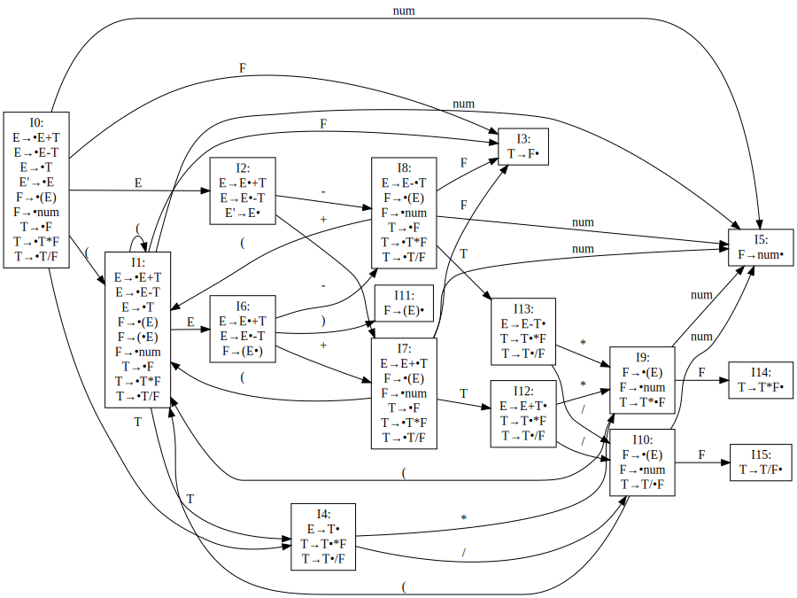

# 实验题目

## 内容

编写 LR 语法分析程序，实现对算术表达式的语法分析。要求所分析算数表达式由如下的文法产生。

$$
\begin{aligned}
E &\to E+T | E-T | T \\
T &\to T*F | T/F | F \\
F &\to (E) | \text{num}
\end{aligned}
$$

## 要求

在对输入的算术表达式进行分析的过程中，依次输出所采用的产生式。

实现方法要求：

1. 构造识别该文法所有活前缀的 DFA。
2. 构造该文法的 LR 分析表。
3. 编程实现算法4.3，构造 LR 分析程序。

# 程序设计说明

## 使用方法

尽管题目不要求编程实现构造识别该文法所有活前缀的 DFA 以及构造该文法的 LR 分析表，但在此还是实现了用程序生成 DFA （即项目集规范族）和 LR 分析表的功能。

程序的使用方法和 LL 分析方法的版本类似。首先在代码中用如下格式配置要解析的文法产生式（默认首字符为大写字母的是非终结符）。

```cpp
Grammar grammar;
grammar.addRule("E", {"E", "+", "T"});
grammar.addRule("E", {"E", "-", "T"});
grammar.addRule("E", {"T"});
grammar.addRule("T", {"T", "*", "F"});
grammar.addRule("T", {"T", "/", "F"});
grammar.addRule("T", {"F"});
grammar.addRule("F", {"(", "E", ")"});
grammar.addRule("F", {"num"});
grammar.setStart("E");
```

然后程序会输出原始产生式以及拓广文法产生式。由于题目要求的文法是 SLR(1) 文法（见下文），程序只支持自动生成 SLR(1) 分析表。如果文法不是 SLR(1) 文法，程序会输出 `Not SLR(1) grammar!` 并退出。如果文法是 SLR(1) 文法，程序会输出使用 Graphviz 格式表示的 DFA 以及构造的 SLR(1) 分析表。以题目要求的文法为例，会输出如下内容：

```
E → E+T|E-T|T
F → (E)|num
T → T*F|T/F|F

E → E+T|E-T|T
E' → E
F → (E)|num
T → T*F|T/F|F

（省略 Graphviz 格式表示的 DFA）

                  action                              goto
      $     (     )     *     +     -     /     num   E     F     T
0           S1                                  S5    2     3     4
1           S1                                  S5    6     3     4
2     ACC                     S7    S8
3     R8          R8    R8    R8    R8    R8
4     R2          R2    S9    R2    R2    S10
5     R5          R5    R5    R5    R5    R5
6                 S11         S7    S8
7           S1                                  S5          3     12
8           S1                                  S5          3     13
9           S1                                  S5          14
10          S1                                  S5          15
11    R4          R4    R4    R4    R4    R4
12    R0          R0    S9    R0    R0    S10
13    R1          R1    S9    R1    R1    S10
14    R6          R6    R6    R6    R6    R6
15    R7          R7    R7    R7    R7    R7
```

DFA 图形如下



从图中可以发现该文法存在潜在的移进-归约冲突，不是 LR(0) 文法，但计算 FOLLOW 集后可以发现该文法是 SLR(1) 文法。

接下来等待用户输入要解析的字符串，输入后程序会依次输出每一步的分析过程（即规范规约），如果输入的字符串符合文法，最后会输出 `Accept!`，否则会输出 `Reject!`。

程序内置了一个简单词法分析器，可以将输入的非负整数转换为 `num`，将输入的 `+`、`-`、`*`、`/`、`(`、`)` 转换为对应的符号，遇到 `$` 或 `EOF` 表示输入结束，忽略空白字符，遇到其他字符则报错。

## 程序结构

程序结构基本继承自 LL 分析方法版本的程序，由 `Grammar` 和 `LR1Table` 这两个主要的类和多种辅助数据结构类型构成。

语法分析中的符号（包括终结符和非终结符）使用 `Symbol` 类型表示，`vector<Symbol>` 被定义为 `Phrase`，即短语。

`map<Symbol, vector<Phrase>>` 类型表示产生式集合，加上初始符号就构成了一个文法，即 `Grammar` 类。`Grammar` 类提供了求FIRST集、求FOLLOW集、构造 SLR(1) 分析表的接口。

`map<pair<int, Symbol>, Action>` 和 `map<pair<Symbol, Symbol>, Phrase>` 类型分别表示 LR(1) 分析表的 action 表和 goto 表。尽管本程序实际构造的是 SLR(1) 分析表，但 LR(1) 分析表和 SLR(1) 分析表在结构和用法上完全一致，因此直接使用 `LR1Table` 命名。`LR1Table` 类提供了使用该表对输入进行分析的接口。接口采用“语法分析驱动”的模式，传入一个返回token的回调函数，每当语法分析需要一个token（即终结符号）时调用一次该函数。

## 算法实现

### 求FIRST集

`getFirstSet` 函数可以求出指定短语的FIRST集，实现方法为：如果是第一个符号终结符则直接加入FIRST集；如果第一个符号是非终结符则将其FIRST集（除了 $ε$ ）加入FIRST集，如果该符号的FIRST集中包含 $ε$ ，则继续处理下一个符号，直到遇到终结符或者某个符号的FIRST集不包含 $ε$ 。如果所有符号的FIRST集都包含 $ε$ ，则将 $ε$ 加入FIRST集。

```cpp
set<Symbol> Grammar::getFirstSet(const Phrase &phrase) const {
    auto iter = firstSetCache_.find(phrase);
    if (iter != firstSetCache_.end()) {
        return iter->second;
    }
    firstSetCache_[phrase] = {}; // 避免无穷递归
    set<Symbol> firstSet;
    bool allHaveEpsilon = true;
    for (const auto &symbol : phrase) {
        if (symbol.isTerminal()) {
            firstSet.insert(symbol);
            allHaveEpsilon = false;
            break;
        } else {
            bool haveEpsilon = false;
            for (const auto &right : rules_.at(symbol)) {
                auto s = getFirstSet(right);
                if (s.find(Symbol::epsilon) != s.end()) {
                    s.erase(Symbol::epsilon);
                    haveEpsilon = true;
                }
                firstSet.merge(s);
            }
            if (!haveEpsilon) {
                allHaveEpsilon = false;
                break;
            }
        }
    }
    if (allHaveEpsilon) {
        firstSet.insert(Symbol::epsilon);
    }
    firstSetCache_[phrase] = firstSet;
    return firstSet;
}
```

### 求FOLLOW集

与求FIRST集不同，`getAllFollowSets` 函数一次性求出所有非终结符的FOLLOW集。由于非迭代实现方法较为复杂，这里直接采用教材上的定义4.4迭代求解。

```cpp
map<Symbol, set<Symbol>> Grammar::getAllFollowSets() const {
    map<Symbol, set<Symbol>> followSets;
    followSets[start_].insert(Symbol::end);
    bool changed = false;
    do {
        changed = false;
        for (const auto &[left, rightList] : rules_) {
            for (const auto &right : rightList) {
                int len = right.size();
                for (int i = 0; i < len; i++) {
                    if (right[i].isTerminal()) {
                        continue;
                    }
                    auto oldFollowSet = followSets[right[i]];
                    Phrase beta(right.begin() + i + 1, right.end());
                    auto betaFirstSet = getFirstSet(beta);
                    if (betaFirstSet.find(Symbol::epsilon) != betaFirstSet.end()) {
                        betaFirstSet.erase(Symbol::epsilon);
                        followSets[right[i]].insert(followSets[left].begin(),
                                                    followSets[left].end());
                    }
                    followSets[right[i]].merge(betaFirstSet);
                    if (oldFollowSet != followSets[right[i]]) {
                        changed = true;
                    }
                }
            }
        }
    } while (changed);
    return followSets;
}
```

### 构造 SLR(1) 分析表

采用教材上的算法4.6即可。

```cpp
set<Item> Grammar::closure(const set<Item> &items) const {
    set<Item> newItems = items;
    bool changed = false;
    do {
        changed = false;
        for (const auto &item : newItems) {
            if (item.dotPos == (ssize_t)item.right.size()) {
                continue;
            }
            Symbol nextSymbol = item.right[item.dotPos];
            if (nextSymbol.isTerminal()) {
                continue;
            }
            for (const auto &right : rules_.at(nextSymbol)) {
                Item newItem{nextSymbol, right, 0, right.idx};
                if (find(newItems.begin(), newItems.end(), newItem) == newItems.end()) {
                    newItems.insert(newItem);
                    changed = true;
                }
            }
        }
    } while (changed);
    return newItems;
}

LR1Table Grammar::buildLR1Table() const {
    auto followSets = getAllFollowSets();

    vector<pair<Symbol, Phrase>> rules;
    for (const auto &[left, rightList] : rules_) {
        for (const auto &right : rightList) {
            rules.push_back({left, right});
        }
    }
    LR1Table table(rules);
    vector<ItemSet> itemSets;
    map<set<Item>, int> items2Id;
    queue<int> q;
    auto startItem = Item{start_, rules_.at(start_)[0], 0, rules_.at(start_)[0].idx};
    auto startItemSet = closure({startItem});
    itemSets.push_back({startItemSet, {}});
    items2Id[startItemSet] = 0;
    q.push(0);
    while (!q.empty()) {
        int id = q.front();
        q.pop();
        map<Symbol, set<Item>> nextKernelItemSets;
        for (const Item &item : itemSets[id].items) {
            if (item.dotPos == (ssize_t)item.right.size()) {
                for (const auto &follow : followSets[item.left]) {
                    if (item.left == start_) {
                        if (!table.tryInsertAction({id, follow}, {Action::ACCEPT, 0})) {
                            printf("Not SLR(1) grammar!\n");
                            exit(0);
                        }
                    } else {
                        if (!table.tryInsertAction({id, follow}, {Action::REDUCE, item.id})) {
                            printf("Not SLR(1) grammar!\n");
                            exit(0);
                        }
                    }
                }
            } else {
                Symbol nextSymbol = item.right[item.dotPos];
                Item newItem = {item.left, item.right, item.dotPos + 1, item.id};
                nextKernelItemSets[nextSymbol].insert(newItem);
            }
        }
        for (const auto &[symbol, itemSet] : nextKernelItemSets) {
            auto nextItemSet = closure(itemSet);
            int nextId;
            if (items2Id.find(nextItemSet) == items2Id.end()) {
                items2Id[nextItemSet] = itemSets.size();
                itemSets.push_back({nextItemSet, {}});
                q.push(itemSets.size() - 1);
                nextId = itemSets.size() - 1;
            } else {
                nextId = items2Id[nextItemSet];
            }
            itemSets[id].to[symbol] = nextId;
            if (symbol.isTerminal()) {
                if (!table.tryInsertAction({id, symbol}, {Action::SHIFT, nextId})) {
                    printf("Not SLR(1) grammar!\n");
                    exit(0);
                }
            } else {
                table.insertGoto({id, symbol}, nextId);
            }
        }
    }
    for (int i = 0; i < (ssize_t)itemSets.size(); i++) {
        printf("I%d[label=\"I%d:\\n", i, i);
        for (const auto &item : itemSets[i].items) {
            std::cout << item << "\\n";
        }
        printf("\"]\n");
        for (const auto &[symbol, dest] : itemSets[i].to) {
            printf("I%d->I%d[label=\"%s\"]\n", i, dest, symbol.name().c_str());
        }
    }
    return table;
}
```

### LR 分析

采用教材上的算法4.3即可。

```cpp
bool LR1Table::parse(std::function<Symbol()> getNext) const {
    stack<int> st;
    st.push(0);
    int step = 0;
    Symbol next = getNext();
    while (!st.empty()) {
        auto top = st.top();
        auto it = action_.find({top, next});
        if (it == action_.end()) {
            return false;
        }
        auto action = it->second;
        if (action.type == Action::ACCEPT) {
            break;
        } else if (action.type == Action::SHIFT) {
            st.push(action.state);
            next = getNext();
        } else if (action.type == Action::REDUCE) {
            std::cout << "(" << ++step << ") ";
            auto rule = rules_[action.rule];
            std::cout << rule.first << " → " << rule.second << std::endl;
            for (int i = 0; i < (ssize_t)rule.second.size(); ++i) {
                st.pop();
            }
            st.push(goto_.at({st.top(), rule.first}));
        }
    }
    return next == Symbol::end;
}
```

# 测试

### 输入1

```
(1+2)*(3+4)+5-(((6)/2))
```

### 输出1

```
(1) F → num
(2) T → F
(3) E → T
(4) F → num
(5) T → F
(6) E → E+T
(7) F → (E)
(8) T → F
(9) F → num
(10) T → F
(11) E → T
(12) F → num
(13) T → F
(14) E → E+T
(15) F → (E)
(16) T → T*F
(17) E → T
(18) F → num
(19) T → F
(20) E → E+T
(21) F → num
(22) T → F
(23) E → T
(24) F → (E)
(25) T → F
(26) F → num
(27) T → T/F
(28) E → T
(29) F → (E)
(30) T → F
(31) E → T
(32) F → (E)
(33) T → F
(34) E → E-T
Accept!
```

程序给出了一个该输入的规范规约。

### 输入2

```
1+2*(3)(4)
```

### 输出2

```
(1) F → num
(2) T → F
(3) E → T
(4) F → num
(5) T → F
(6) F → num
(7) T → F
(8) E → T
Reject!
```

# 总结

这次实验让我熟悉了构造 LR 项目集规范族的方法和 LR 分析方法，也锻炼了编程能力和测试能力。
