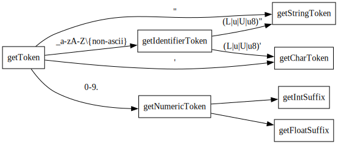

# 概述

## 实验内容与要求

1. 选定源语言，比如：C、Pascal、Python、Java 等，任何一种语言均可；
2. 可以识别出用源语言编写的源程序中的每个单词符号，并以记号的形式输出每个单词符号。
3. 可以识别并跳过源程序中的注释。
4. 可以统计源程序中的语句行数、各类单词的个数、以及字符总数，并输出统计结果。
5. 检查源程序中存在的词法错误，并报告错误所在的位置。
6. 对源程序中出现的错误进行适当的恢复，使词法分析可以继续进行，对源程序进行一次扫描，即可检查并报告源程序中存在的所有词法错误。
7. 采用 C/C++ 作为实现语言，手工编写词法分析程序。

## 实现的内容

使用 C++ 构建了一个 C 语言的词法分析程序，支持除了预处理器和替用记号外的 C17 标准中的所有词法元素，具有统计功能和友好的错误提示。

# 程序设计说明

## 设计规格

本程序参照 C17 标准文档编写，尽可能完整地实现了 C17 标准的所有内容，仅考虑实际情况做了以下简化：

1. 不支持与预处理器相关的内容。C 语言的基于文本替换的预处理器是一个比较特殊的设计。C 语言的 token 实际上分为预处理前的 preprocessing-token 和预处理后的 token，尤其是对数字的定义方面两者存在较大的差异。预处理时拼接行尾反斜杠的特性也破坏了词法的正则性。为了降低复杂性，我们只识别预处理后的 token，不考虑与预处理器相关的部分，也就是认为：
    - 所有的宏定义都已经被展开
    - 不存在行尾的反斜杠
    - 不存在三标符
    - 不存在不是合法整数或合法浮点数的预处理数字
    - `#` 直到行尾将被如同注释地忽略

2. 不支持替用记号，即 `<%` `%>` 等记号。

支持 UTF-8 编码的源文件，可以在标识符中使用 Unicode 字符。

程序使用命令行交互，可通过参数指定输入文件（若不指定则为标准输入），token 流和统计信息输出到标准输出流，错误和警告信息输出到标准错误流。

程序将所有的 token 分为以下 7 类：

- 关键字 keyword
- 标识符 identifier
- 标点 punctuator 
- 整数常量 integer constant
- 浮点数常量 floating constant
- 字符常量 character constant
- 字符串字面量 string literal

出现错误时会输出为一个类型为 error 的 token。

其中关键字包括：

|                  |                 |            |            |              |             |
| ---------------- | --------------- | ---------- | ---------- | ------------ | ----------- |
| `auto`           | `break`         | `case`     | `char`     | `const`      | `continue`  |
| `default`        | `do`            | `double`   | `else`     | `enum`       | `extern`    |
| `float`          | `for`           | `goto`     | `if`       | `inline`     | `int`       |
| `long`           | `register`      | `restrict` | `return`   | `short`      | `signed`    |
| `sizeof`         | `static`        | `struct`   | `switch`   | `typedef`    | `union`     |
| `unsigned`       | `void`          | `volatile` | `while`    | `_Alignas`   | `_Alignof`  |
| `_Atomic`        | `_Bool`         | `_Complex` | `_Generic` | `_Imaginary` | `_Noreturn` |
| `_Static_assert` | `_Thread_local` |            |            |              |             |

标点包括：

|      |      |      |      |      |       |      |      |       |     |     |      |
| ---- | ---- | ---- | ---- | ---- | ----- | ---- | ---- | ----- | --- | --- | ---- |
| `{`  | `}`  | `[`  | `]`  | `(`  | `)`   | `;`  | `:`  | `...` | `?` | `.` | `->` |
| `~`  | `!`  | `+`  | `-`  | `*`  | `/`   | `%`  | `^`  | `&`   | `|` | `=` | `+=` |
| `-=` | `*=` | `/=` | `%=` | `^=` | `&=`  | `|=` | `==` | `!=`  | `<` | `>` | `<=` |
| `>=` | `&&` | `||` | `<<` | `>>` | `<<=` | `>>=`| `++` | `--`  | `,` |     |      |


## 程序结构

程序的结构较为简单。`Lexer` 类是程序的主体。`main` 函数中创建一个 `Lexer` 对象，每次调用该对象的 `getToken` 方法即读出一个 token。最后使用 `printStat` 方法输出统计信息。

辅助结构体 `Token` 保存了一个 token 的类型和值，以及在源文件中的起始行和列。

## 词法分析器实现

`Lexer` 类中实现了词法分析，其本质就是一个根据词法规则编写的自动机。

`Lexer` 使用构造时传入的 `std::istream` 作为输入流的抽象。在此基础上编写了一些用于词法分析的工具函数。

- `peek` 函数获取下一个字符，但不移动指针
- `get` 函数获取下一个字符并移动指针，将该字符放入 token 缓冲区
- `pass` 函数获取下一个字符并移动指针，但不将该字符放入 token 缓冲区

为了提高代码可读性，程序把整个状态机拆分成了若干子状态机，每个子状态机都是一个函数。

```c++
Token getToken(); // 入口函数，即主状态机，识别标点和注释

Token getIdentifierToken(); // 识别标识符、关键字和带前缀的字符常量/字符串字面量
Token getStringToken(); // 识别字符串字面量
Token getCharToken(); // 识别字符常量
Token getNumericToken(bool readDot); // 识别整数常量和浮点数常量

// 以下函数识别的是 token 的一部分
bool getEscapeSequence(); // 识别转义序列
bool getIntSuffix(); // 识别整数后缀
bool getFloatSuffix(); // 识别浮点数后缀
bool getUniversalCharacterName(); // 识别通用字符名
```

所有的标点和注释在主状态机中识别，除此以外的 token 根据首字符进入不同的子状态机识别。

主状态机和各子状态机的转移关系见图一（为了简洁省略了 `getEscapeSequence` 和 `getUniversalCharacterName`）。由于字符常量和字符串字面量可以包含 `L`, `u`, `U`, `u8` 前缀，因此进入 `getIdentifierToken` 后仍有可能进入 `getStringToken` 或 `getCharToken`。

{width=80%}

`getEscapeSequence` 用于在字符常量和字符串字面量中识别转义序列。这个函数被 `getCharToken` 和 `getStringToken` 调用。

`getUniversalCharacterName` 用于识别通用字符名，通用字符名是在 C99 中引入的一种可以在标识符、字符常量和字符串字面量中使用的转义序列，用于表示 Unicode 字符。这个函数被 `getIdentifierToken` 和 `getEscapeSequence` 调用。

大部分子状态机都很简单，只有 `getNumericToken` 较为复杂，需要识别十进制、八进制、十六进制整数常量和十进制、十六进制浮点数常量。图二展示了 `getNumericToken` 的状态转移图。


## 错误处理

程序实现了较为友好的错误输出与恢复。遇到错误时程序可以给出行号、列号和错误原因。遇到错误后可以立即恢复，出错位置之后的 token 仍可正常输出。

考虑到实际编译器的处理方法，在字符常量和字符串字面量中遇到反斜杠后不是合法转移序列的情况不会认为是错误，而是产生一个警告，并继续识别字符常量或字符串字面量。

# 测试

由于篇幅限制，仅包含较为简短的测试用例。

## 基本正常程序测试

### 输入

```c
#include <stdio.h>
int main(void) {
    int sum = 0;
    for (int i = 0; i < 100; i++) {
        sum += i;
    }
    printf("sum: %d\n", sum);
}
```

### 输出

```
2:1: <keyword, int>
2:5: <identifier, main>
2:9: <punctuator, (>
2:10: <keyword, void>
2:14: <punctuator, )>
2:16: <punctuator, {>
3:5: <keyword, int>
3:9: <identifier, sum>
3:13: <punctuator, =>
3:15: <integer constant, 0>
3:16: <punctuator, ;>
4:5: <keyword, for>
4:9: <punctuator, (>
4:10: <keyword, int>
4:14: <identifier, i>
4:16: <punctuator, =>
4:18: <integer constant, 0>
4:19: <punctuator, ;>
4:21: <identifier, i>
4:23: <punctuator, <>
4:25: <integer constant, 100>
4:28: <punctuator, ;>
4:30: <identifier, i>
4:31: <punctuator, ++>
4:33: <punctuator, )>
4:35: <punctuator, {>
5:9: <identifier, sum>
5:13: <punctuator, +=>
5:16: <identifier, i>
5:17: <punctuator, ;>
6:5: <punctuator, }>
7:5: <identifier, printf>
7:11: <punctuator, (>
7:12: <string literal, "sum: %d\n">
7:23: <punctuator, ,>
7:25: <identifier, sum>
7:28: <punctuator, )>
7:29: <punctuator, ;>
8:1: <punctuator, }>

stat:
total: 144 characters, 8 lines
tokens:
  identifier:
    i                              4
    main                           1
    printf                         1
    sum                            3
    (total)                        9
  integer constant:
    0                              2
    100                            1
    (total)                        3
  keyword:
    for                            1
    int                            3
    void                           1
    (total)                        5
  punctuator:
    (                              3
    )                              3
    ++                             1
    +=                             1
    ,                              1
    ;                              5
    <                              1
    =                              2
    {                              2
    }                              2
    (total)                        21
  string literal:
    "sum: %d\n"                    1
    (total)                        1
  (total)                          39

```

### 说明

程序很好地完成了工作。

## 复杂数字测试

### 输入

```c
int main(void) {
    -0ll+0x123u*0123;
    0xabcdefghijk/0912%0912.0;
    1.e+2+0e-2-0x0.4p-2;
    3.4ll+-322lul+3L-3lL;
    12.4qwq+0x12.3P43;
    0x124+000-111e;
}
```

### 输出
```
1:1: <keyword, int>
1:5: <identifier, main>
1:9: <punctuator, (>
1:10: <keyword, void>
1:14: <punctuator, )>
1:16: <punctuator, {>
2:5: <punctuator, ->
2:6: <integer constant, 0ll>
2:9: <punctuator, +>
2:10: <integer constant, 0x123u>
2:16: <punctuator, *>
2:17: <integer constant, 0123>
2:21: <punctuator, ;>
3:5: <error, 0xabcdefghijk>
3:18: <punctuator, />
3:19: <error, 0912>
3:23: <punctuator, %>
3:24: <floating constant, 0912.0>
3:30: <punctuator, ;>
4:5: <floating constant, 1.e+2>
4:10: <punctuator, +>
4:11: <floating constant, 0e-2>
4:15: <punctuator, ->
4:16: <floating constant, 0x0.4p-2>
4:24: <punctuator, ;>
5:5: <error, 3.4ll>
5:10: <punctuator, +>
5:11: <punctuator, ->
5:12: <error, 322lul>
5:18: <punctuator, +>
5:19: <integer constant, 3L>
5:21: <punctuator, ->
5:22: <error, 3lL>
5:25: <punctuator, ;>
6:5: <error, 12.4qwq>
6:12: <punctuator, +>
6:13: <floating constant, 0x12.3P43>
6:22: <punctuator, ;>
7:5: <integer constant, 0x124>
7:10: <punctuator, +>
7:11: <integer constant, 000>
7:14: <punctuator, ->
7:15: <error, 111e>
7:19: <punctuator, ;>
8:1: <punctuator, }>

stat:
total: 165 characters, 8 lines
tokens:
  error:
    0912                           1
    0xabcdefghijk                  1
    111e                           1
    12.4qwq                        1
    3.4ll                          1
    322lul                         1
    3lL                            1
    (total)                        7
  floating constant:
    0912.0                         1
    0e-2                           1
    0x0.4p-2                       1
    0x12.3P43                      1
    1.e+2                          1
    (total)                        5
  identifier:
    main                           1
    (total)                        1
  integer constant:
    000                            1
    0123                           1
    0ll                            1
    0x123u                         1
    0x124                          1
    3L                             1
    (total)                        6
  keyword:
    int                            1
    void                           1
    (total)                        2
  punctuator:
    %                              1
    (                              1
    )                              1
    *                              1
    +                              6
    -                              5
    /                              1
    ;                              6
    {                              1
    }                              1
    (total)                        24
  (total)                          45

```

### 错误

```
3:18: error: invalid integer suffix ghijk
3:23: error: invalid octal integer constant
5:10: error: invalid float number suffix ll
5:18: error: invalid integer suffix lul
5:25: error: invalid integer suffix lL
6:12: error: invalid float number suffix qwq
7:19: error: invalid float number
```

### 说明

一个有趣的情形是 `0912` 是非法的（`0`开头的是八进制整数，但出现了 `9`），但 `0912.0` 是合法的十进制浮点数。程序正确地对前者报错并识别了后者。

十六进制浮点数是一个较为少用的语法特性，测试可见程序正确支持了十六进制浮点数。

遇到错误的整数/浮点数后缀时程序能够提示该后缀非法，如程序对 `322lul` 提示 `5:18: error: invalid integer suffix lul`。

## 复杂字符常量、字符串字面量与通用字符名测试

### 输入

```c
int main(void) {
    char *\u1234 = u8"\a\b\f\n\r\t\v\012\xab\U12345678";
    mm\u123 = L"\qabc";
    U'3' == '';
    "this is a
    '\t
}
```

### 输出

```
1:1: <keyword, int>
1:5: <identifier, main>
1:9: <punctuator, (>
1:10: <keyword, void>
1:14: <punctuator, )>
1:16: <punctuator, {>
2:5: <keyword, char>
2:10: <punctuator, *>
2:11: <identifier, \u1234>
2:18: <punctuator, =>
2:20: <string literal, u8"\a\b\f\n\r\t\v\012\xab\U12345678">
2:56: <punctuator, ;>
3:5: <error, mm\u123>
3:13: <punctuator, =>
3:15: <string literal, L"\qabc">
3:23: <punctuator, ;>
4:5: <char constant, U'3'>
4:10: <punctuator, ==>
4:13: <error, ''>
4:15: <punctuator, ;>
5:5: <error, "this is a>
6:5: <error, '\t>
7:1: <punctuator, }>

stat:
total: 138 characters, 7 lines
tokens:
  char constant:
    U'3'                           1
    (total)                        1
  error:
    "this is a                     1
    ''                             1
    '\t                            1
    mm\u123                        1
    (total)                        4
  identifier:
    \u1234                         1
    main                           1
    (total)                        2
  keyword:
    char                           1
    int                            1
    void                           1
    (total)                        3
  punctuator:
    (                              1
    )                              1
    *                              1
    ;                              3
    =                              2
    ==                             1
    {                              1
    }                              1
    (total)                        11
  string literal:
    L"\qabc"                       1
    u8"\a\b\f\n\r\t\v\012\xab\U12345678" 1
    (total)                        2
  (total)                          23

```

### 错误

```
3:12: error: invalid universal character name
3:19: warning: unknown escape sequence \q
4:15: error: empty char constant
5:15: error: unterminated string literal
6:8: error: unterminated char constant
```

### 说明

第二行测试了标识符中的通用字符名和字符串字面量中的所有转移字符。

第三行的通用字符名少了一位，程序可以发现错误并将整个标识符视为一个错误。后面的字符串中 `\q` 不是合法的转义序列，但程序仍识别了该字符串并给出一个警告。

第四行中字符常量不能为空，程序正确地给出了错误。

第五、六行演示了对未正确闭合的字符串字面量和字符常量的处理，可以看到错误提示非常友好易读。

这段程序还测试了字符串字面量和字符常量的编码前缀`L`, `u`, `U`, `u8`。

## Unicode 源文件测试

### 输入

```c
int main(void) {
    // 中文注释
    char *中文 = "你好";
    char *日本語 = "こんにちは";
}
```

### 输出

```
1:1: <keyword, int>
1:5: <identifier, main>
1:9: <punctuator, (>
1:10: <keyword, void>
1:14: <punctuator, )>
1:16: <punctuator, {>
3:5: <keyword, char>
3:10: <punctuator, *>
3:11: <identifier, 中文>
3:18: <punctuator, =>
3:20: <string literal, "你好">
3:28: <punctuator, ;>
4:5: <keyword, char>
4:10: <punctuator, *>
4:11: <identifier, 日本語>
4:21: <punctuator, =>
4:23: <string literal, "こんにちは">
4:40: <punctuator, ;>
5:1: <punctuator, }>

stat:
total: 108 characters, 5 lines
tokens:
  identifier:
    main                           1
    中文                         1
    日本語                      1
    (total)                        3
  keyword:
    char                           2
    int                            1
    void                           1
    (total)                        4
  punctuator:
    (                              1
    )                              1
    *                              2
    ;                              2
    =                              2
    {                              1
    }                              1
    (total)                        10
  string literal:
    "こんにちは"              1
    "你好"                       1
    (total)                        2
  (total)                          19

```

### 说明

程序也支持 emoji，但由于排版系统不便输入 emoji 没有在此演示。

# 总结

这次实验让我了解了设计词法分析程序的一般方法，对正则语言、自动机等概念有了更好的认识，锻炼了编程能力和测试能力，也对 C 语言的词法细节有了更加深入的了解。
